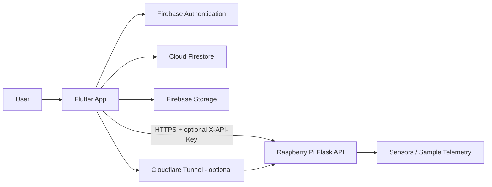

# Solar Pesticide Sprayer — Flutter + Firebase + Raspberry Pi

A full-stack engineering demo that connects a **Flutter application**, **Firebase Authentication/Firestore/Storage**, and an optional **Raspberry Pi telemetry API**.

The project demonstrates how a mobile/desktop client, managed cloud backend, and edge device can work together with clear authentication boundaries, storage, API communication, deployment, and troubleshooting documentation.

## Architecture



See [docs/architecture.md](docs/architecture.md) for the component-level design.

## Main capabilities

- Email/password authentication with Firebase
- Auth-state gate between login and application UI
- Firestore CRUD demo
- Firebase Storage upload/download flow
- Raspberry Pi telemetry polling
- Optional `X-API-Key` protection for the Pi endpoint
- Optional Cloudflare Tunnel for remote Pi access
- Android build workflow
- Multi-layer troubleshooting and security documentation

## Request flow

### User authentication

```text
User → LoginScreen → AuthService → Firebase Authentication
                               ↓
                      authenticated session
                               ↓
                        authStateChanges()
                               ↓
                           AuthGate
                               ↓
                      BackendHomeScreen
```

### Raspberry Pi telemetry

```text
Flutter dashboard
      │ GET /data
      │ X-API-Key (optional)
      ▼
Raspberry Pi Flask API
      │
      ▼
read_sensors()
      │
      ▼
JSON telemetry
      │
      ▼
Flutter DataWidget
```

Detailed flows: [docs/request-flows.md](docs/request-flows.md)

## Repository structure

```text
iee_project/
├── lib/
│   ├── main.dart
│   ├── screens/
│   ├── services/
│   └── widgets/
├── raspberry/
│   └── solar_api.py
├── firebase/
├── android/
├── docs/
│   ├── architecture.md
│   ├── request-flows.md
│   ├── deployment.md
│   ├── security.md
│   ├── troubleshooting.md
│   ├── firebase_android_setup.md
│   ├── cloudflare_tunnel_pi.md
│   └── change_firebase_project.md
└── diagrams/
```

## Quick start

### Flutter app

```bash
flutter pub get
flutter analyze
flutter run
```

For Android APK:

```bash
flutter build apk --debug
```

### Firebase

Follow [docs/firebase_android_setup.md](docs/firebase_android_setup.md).

Enable:

- Authentication → Email/Password
- Firestore Database
- Firebase Storage

### Raspberry Pi API

```bash
cd raspberry
python3 -m venv .venv
source .venv/bin/activate
pip install -r requirements.txt
python3 solar_api.py
```

Then test:

```bash
curl http://127.0.0.1:5000/data
```

To require an API token:

```bash
export SOLAR_API_TOKEN='replace-with-a-strong-secret'
curl -H "X-API-Key: $SOLAR_API_TOKEN" http://127.0.0.1:5000/data
```

## Engineering documentation

| Topic | Guide |
|---|---|
| System design | [docs/architecture.md](docs/architecture.md) |
| Request/data flows | [docs/request-flows.md](docs/request-flows.md) |
| Deployment | [docs/deployment.md](docs/deployment.md) |
| Security | [docs/security.md](docs/security.md) |
| Troubleshooting | [docs/troubleshooting.md](docs/troubleshooting.md) |
| Firebase Android setup | [docs/firebase_android_setup.md](docs/firebase_android_setup.md) |
| Change Firebase project | [docs/change_firebase_project.md](docs/change_firebase_project.md) |
| Remote Pi access | [docs/cloudflare_tunnel_pi.md](docs/cloudflare_tunnel_pi.md) |

## Security model

The project intentionally separates two authentication domains:

1. **Firebase identity** for users, Firestore, and Storage.
2. **Raspberry Pi API token** for edge telemetry access.

Sensitive credentials should not be committed to Git. The Pi secret is read from `SOLAR_API_TOKEN`, while Firebase authorization is enforced through Authentication + Security Rules.

## What this project demonstrates

- Flutter application architecture
- Firebase Authentication and authorization concepts
- Firestore and cloud storage integration
- REST API design and consumption
- Raspberry Pi / edge integration
- credential and token handling
- cloud-to-edge request flow
- troubleshooting across application, backend, network, and device layers
- deployment documentation and engineering handoff practices

## Author

**Wahdat Ullah** — HPC, Linux Systems, Cloud, DevOps, Kubernetes, Security & MLOps

[GitHub Profile](https://github.com/wahdatullah70) · [Engineering Portfolio](https://github.com/wahdatullah70/My_Protfolio)
