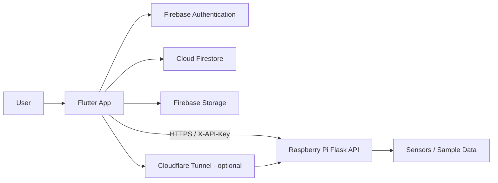

# System Architecture

The project combines a Flutter client, Firebase services, and an optional Raspberry Pi telemetry API.

## High-level architecture



## Components

### Flutter client

Responsibilities:

- login / account creation UI;
- auth-state routing;
- Firestore CRUD UI;
- file upload/download UI;
- Raspberry Pi endpoint configuration;
- telemetry display.

Key code:

```text
lib/main.dart
lib/screens/auth_gate.dart
lib/screens/login_screen.dart
lib/screens/backend_home.dart
lib/services/auth_service.dart
lib/services/data_service.dart
lib/services/storage_service*.dart
```

### Firebase Authentication

The app uses Firebase email/password authentication. Password verification and session handling are delegated to Firebase rather than implemented in the Flutter application.

### Firestore

The demo collection stores application data and relies on Firebase Security Rules to determine whether an authenticated user is allowed to read/write.

### Firebase Storage

Files are uploaded through the Firebase SDK. The documented rules use the authenticated Firebase UID to scope user storage paths.

### Raspberry Pi API

The Flask service exposes telemetry at:

```text
GET /data
```

If `SOLAR_API_TOKEN` is configured on the Pi, callers must provide:

```http
X-API-Key: <token>
```

### Cloudflare Tunnel

An optional tunnel can expose the Raspberry Pi service without directly opening the Pi to inbound public traffic. See `cloudflare_tunnel_pi.md`.

## Trust boundaries

```text
Mobile / Desktop App
      │
      ├── Firebase SDK ──> Firebase project
      │
      └── HTTPS ─────────> Pi API / tunnel

Firebase Project
      ├── Authentication
      ├── Firestore
      └── Storage

Raspberry Pi
      ├── Flask API
      ├── API token from environment
      └── sensor-reading implementation
```

## Design principles

- no Firebase Admin credentials in the client;
- no Pi API secret hard-coded in source;
- authentication and authorization are separate concerns;
- service-specific credentials are handled by the appropriate platform;
- infrastructure and setup are documented so another engineer can reproduce the demo.
